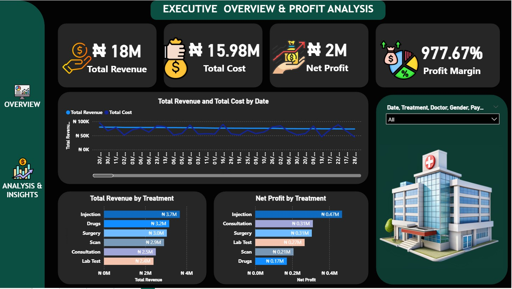

# 👋 Hi, I'm Adeyeni Sunday Adekunle

🎯 Data Analyst | 📊 Power BI | 📈 Excel | 🗄 SQL  

---

## 🚀 About Me
I am a passionate Data Analyst focused on turning raw data into meaningful insights.  
I enjoy building dashboards, analyzing trends, and solving real-world problems with data.

---

## 🛠 Skills
- 📊 Power BI (Dashboard, DAX)
- 📈 Excel (Pivot Tables, Data Cleaning)
- 🗄 SQL (MySQL, PostgreSQL)
- 🐍 Python (Pandas, Matplotlib)

---

## 📂 Projects

### 📊 Clinic Financial Analysis
- Analyzed revenue, expenses, and profitability
- Built interactive Power BI dashboard
- Identified 34% loss-making transactions  

---

### 📈 Sales Dashboard
- Designed KPI dashboard using Power BI
- Visualized sales trends and performance  

👉 [View Project](#)

---

## 📊 GitHub Stats

---

## 📫 Contact Me
- Email: adeyenisunday@gmail.com  
- LinkedIn: your link  

---

⭐️ Always learning. Always improving.
